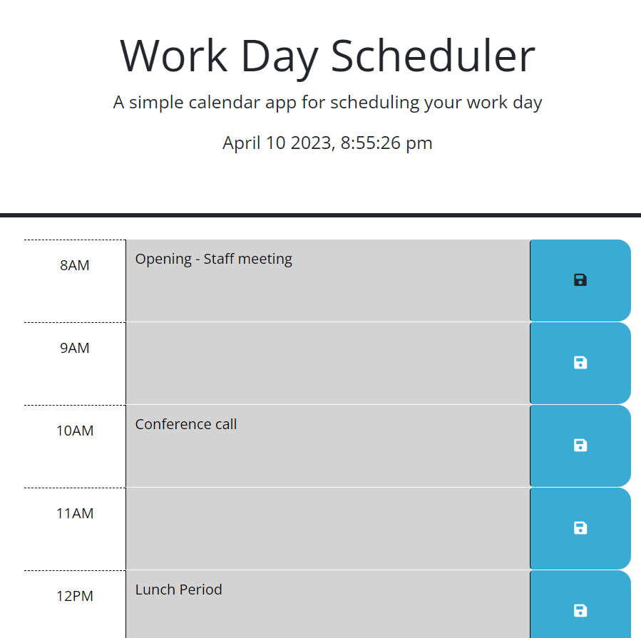

# Work Day Scheduler

## Description

Provides an updated clock and planner with hour blocks throughout a workday. This will update to show you past, present and future as the day goes on. 

## Usage

Application will automatically start once the page is loaded. Type into the hour blocks and click the save icon to store your events locally, so you can refresh the page and it will still be there. 

## URL

[Deployed URL]()

[GitHub Repo](https://github.com/Katsu-001/daily-calendar)